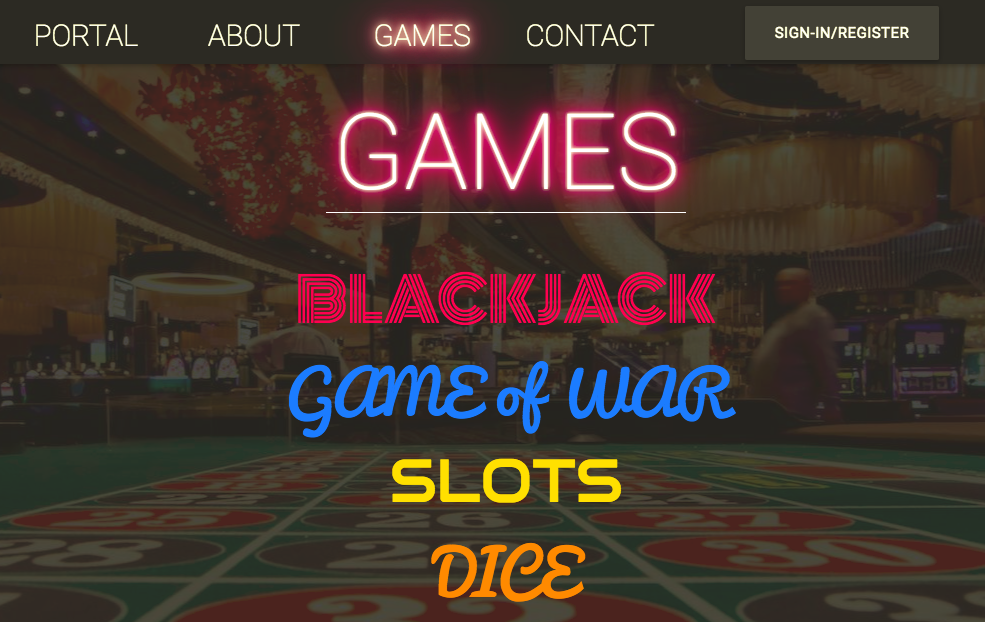
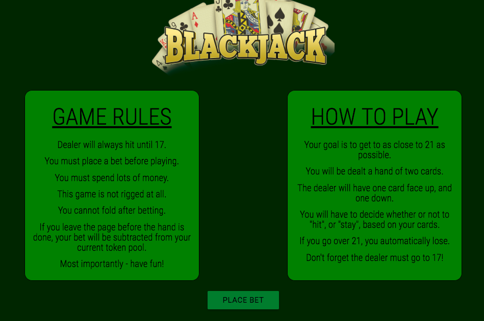
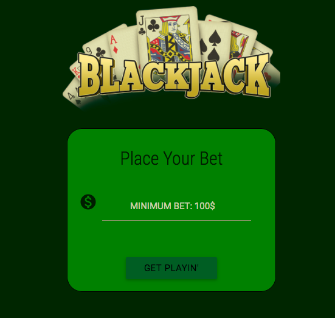
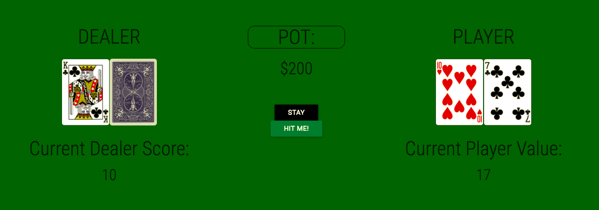
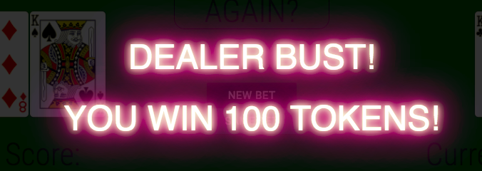
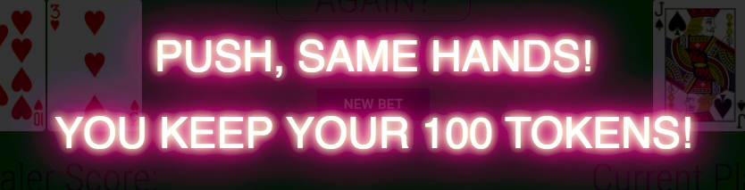
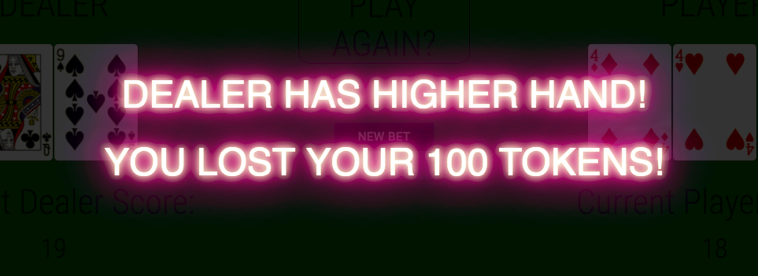

#G-amblin

You can access my self-assessment of this site at by [clicking here (this will take you to a Google Document)](https://docs.google.com/document/d/1Vvp2nPoQsEOxBRIHg3rh_Eq-RUdcIhex7XBSEAMPqGU/edit?usp=sharing).

The [G-amblin](https://g-amblin.surge.sh/) site was built to be a resource for those that don't know how to gamble. If someone was worried about going to Las Vegas (or any gambling scene/area) while not knowing the rules, g-amblin would be an online destination to learn the rules of the games.

Upon entering the site, a user is interfaced with an index page. This page links to the various places on the site, including a games-index, contact and "about" page. This site utilized the [Deck of Cards API](http://deckofcardsapi.com) to create the games Blackjack and Game of War. The user is prompted to access the "games" page with a highlighted area in the navigation window.

On the games portal, the user is faced with 7 different game options, with only the first two being available. I would have enjoyed to get the other games done, but they remain as stretch goals, taking a venture into the Blackjack game for now.

After accessing the Blackjack game, they're faced with a rules and "how to play" screen, these were created with UI in mind, interfacing green on dark green for a "poker table like appearance". After going through the page, you can place a bet.

Placing a bet is very simple, the page is self-explanatory and it will help any user to understand how bets are made/work.

After this is done, you will be on the Blackjack interface. This interface is fully cooperative with the Blackjack games, using jQuery and mathematical logic on the backend. You can win/lose/push, as in standard Blackjack, and the dealer will hit until 17, as in most casinos.

You can access the site yourself by [clicking here](https://g-amblin.surge.sh).
